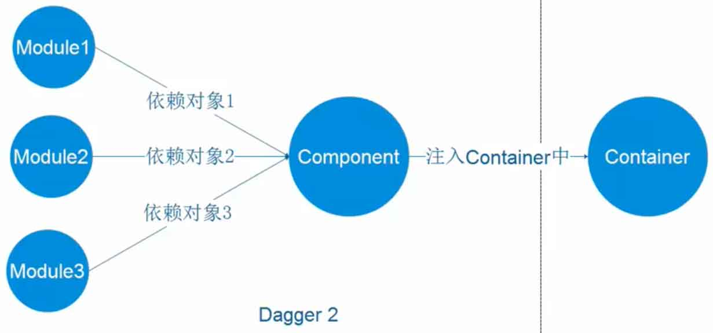

# dagger2

## dagger构成

构成的元素有三种：Module,Component,Container




## dagger2使用

| 注解符        | 作用                                       |
| ---------- | :--------------------------------------- |
| @Inject    | 通常在需要依赖的地方使用这个注解。换句话说，你用它告诉Dagger这个类或者字段需要依赖注入。这样，Dagger这回构造一个一个这个类的实例并满足他们的依赖。 |
| @Module    | Module类里面的方法专门提供依赖，所以我们定义一个类，用@Module注解，这样Dagger在构造类的实例时候，就知道从哪里去寻找需要的依赖。modules的一个重要的特征是他们设计为分区并组合在一起（比如说，我们的app中可以有多个组成在一起的modules） |
| @Provide   | 在modules中，我们定义的方法是用这个注解，以此来告诉Dagger我们想要构造对象并提供这些依赖。 |
| @Component | Components从根本上说就是一个注入器，也可以说是@Inject和@Module的桥梁，它的主要作用就是连接这两部分。Components可以提供所有定义了的类型的实例，比如：我们必须用@Component注解一个接口然后列出所有的 |


## 简单示例

先定义一个云端API存储服务ApiService和一个本地存储服务UserStore。

ApiService.class

```
public class ApiService {

    private static final String TAG=ApiService.class.getSimpleName();

    public void register(){
        Log.d(TAG, "register: ApiService");
    }
}
```


UserStore.class

```
public class UserStore {

    private static final String TAG=ApiService.class.getSimpleName();

    public void register(){
        Log.d(TAG, "register: UserSore");
    }
}
```


再定义一个用户操作管理类UserManager.class

```
public class UserManager {

    private UserStore userStore;

    private ApiService apiService;

    public UserManager() {
        userStore=new UserStore();

        apiService=new ApiService();
    }

    public void register(){

        userStore.register();

        apiService.register();
    }
}
```


最后创建一个MainActivity

```
public class MainActivity extends AppCompatActivity {

    private UserManager userManager;

    @Override
    protected void onCreate(Bundle savedInstanceState) {
        super.onCreate(savedInstanceState);
        setContentView(R.layout.activity_main);

        userManager = new UserManager();

        userManager.register();

    }
}
```

这样一个简单的服务就完成了。下面用Dagger的方法实现一个简单的依赖注入。


首先创建一个Module类UserModule

```
import dagger.Module;
import dagger.Provides;

@Module    //以此显示这是一个Module
public class UserModule {

    @Provides  //告诉Dagger想要构造的对象并提供这个依赖
    public ApiService getApiService(){
        return new ApiService();
    }
}
```

然后创建一个Component接口UserComponent

```
@Component(modules = {UserModule.class})   //这句话将Componet与module关联起来
public interface UserComponent {

    void inject(MainActivity activity);  //这句话将Component与Container（也就是Activity）关联起来

}
```

最后在MainActivity中进行注入

```
import android.support.v7.app.AppCompatActivity;
import android.os.Bundle;

import javax.inject.Inject;

public class MainActivity extends AppCompatActivity {

    @Inject   //告诉dagger此处需要依赖注入
    ApiService mApiService;

    @Override
    protected void onCreate(Bundle savedInstanceState) {
        super.onCreate(savedInstanceState);
        setContentView(R.layout.activity_main);

        DaggerUserComponent.create().inject(this);

        mApiService.register();

    }
}
```

这样一个简单的依赖注入就完成了。


下面是一个带ApiService参数注入的例子。

首先改变一下UserManager，暂时只使用ApiService

```
public class UserManager {

    private ApiService apiService;

    public UserManager(ApiService apiService) {

        this.apiService=apiService;
    }

    public void register(){

        apiService.register();
    }
}
```

再修改一下UserModule

```
import dagger.Module;
import dagger.Provides;

@Module    //以此显示这是一个Module
public class UserModule {

    @Provides  //告诉Dagger想要构造的对象并提供这个依赖
    public ApiService getApiService(){
        return new ApiService();
    }

    @Provides
    public UserManager userManager(ApiService apiService){
        return new UserManager(apiService);
    }
}
```

这里的ApiService有两种注入方法，先使用在UserModule中注入的这种方法。

UserComponent不用修改，最后修改一下MainActivity

```java
import android.support.v7.app.AppCompatActivity;
import android.os.Bundle;

import javax.inject.Inject;

public class MainActivity extends AppCompatActivity {

    @Inject
    UserManager userManager;

    @Override
    protected void onCreate(Bundle savedInstanceState) {
        super.onCreate(savedInstanceState);
        setContentView(R.layout.activity_main);

        DaggerUserComponent.create().inject(this);

        userManager.register();
    }
}
```

这样UserManager中带参数注入的第一种方法就完成了。

第二种方法,在ApiService的构造方法中对ApiService进行注入

```
public class ApiService {

    private static final String TAG=ApiService.class.getSimpleName();

    @Inject
    public ApiService() {
        Log.d(TAG, "ApiService: constractor");
    }

    public void register(){
        Log.d(TAG, "register: ApiService");
    }
}
```

并将UserManager中将之前注入ApiService的方法注释掉

```
@Module    //以此显示这是一个Module
public class UserModule {

    private static  final String TAG=UserModule.class.getSimpleName();

//    @Provides  //告诉Dagger想要构造的对象并提供这个依赖
//    public ApiService getApiService(){
//        Log.d(TAG, "getApiService: ");
//        return new ApiService();
//    }

    @Provides
    public UserManager userManager(ApiService apiService){
        Log.d(TAG, "userManager: ");
        return new UserManager(apiService);
    }
}
```

现在将ApiService进行修改

```
public class ApiService {

    private static final String TAG=ApiService.class.getSimpleName();

    public ApiService() {
        Log.d(TAG, "ApiService: constractor");
    }

    @Inject
    public ApiService(String url) {
        Log.d(TAG, "ApiService url : "+url);
    }

    public void register(){
        Log.d(TAG, "register: ApiService");
    }
}

```

并在UserModule中加入提供url的依赖

```
@Module    //以此显示这是一个Module
public class UserModule {

    private static  final String TAG=UserModule.class.getSimpleName();

    @Provides
    public String url(){
        return "www.test.com";
    }

    @Provides
    public UserManager userManager(ApiService apiService){
        Log.d(TAG, "userManager: ");
        return new UserManager(apiService);
    }
}
```

最终的结果是

```
D/ApiService: ApiService url : www.test.com
D/UserModule: userManager: 
D/ApiService: register: ApiService
```

说明APIservice默认调用的是带有@Inject注解的构造方法

下面在UserModule中重新加入UserStore,并在UserStore的构造方法中加入Context参数

```
public class UserStore {

    private static final String TAG=ApiService.class.getSimpleName();

    private Context context;

    public UserStore(Context context) {
        this.context = context;
    }

    public void register(){
        Log.d(TAG, "register: UserSore");
    }
}
```

然后UserManager进行修改

```
public class UserManager {

    private UserStore userStore;

    private ApiService apiService;

    public UserManager(ApiService apiService,UserStore userStore) {
        this.userStore=userStore;

        this.apiService=apiService;
    }

    public void register(){

        userStore.register();

        apiService.register();
    }
}
```

UserModule也进行修改，在UserModule的构造函数中加入Context参数

```
import android.content.Context;
import android.util.Log;

import dagger.Module;
import dagger.Provides;

/**
 * Created by xvjialing on 2017/12/3.
 */

@Module    //以此显示这是一个Module
public class UserModule {

    private static  final String TAG=UserModule.class.getSimpleName();

    private Context context;

    public UserModule(Context context) {
        this.context = context;
    }

    @Provides
    public String url(){
        return "www.test.com";
    }

    @Provides
    public UserStore provideUserStore(){
        return new UserStore(this.context);
    }

    @Provides
    public UserManager userManager(ApiService apiService,UserStore userStore){
        Log.d(TAG, "userManager: ");
        return new UserManager(apiService,userStore);
    }
}
```

最后修改MainActivity

```
public class MainActivity extends AppCompatActivity {

    @Inject
    UserManager userManager;

	// 因为Module中需要传参，所以DaggerUserComponent无法使用create方法，而是使用builder方法，并将context参数传入其中
    @Override
    protected void onCreate(Bundle savedInstanceState) {
        super.onCreate(savedInstanceState);
        setContentView(R.layout.activity_main);

        DaggerUserComponent
                .builder()
                .userModule(new UserModule(this))
                .build()
                .inject(this);

        userManager.register();
    }
}
```


